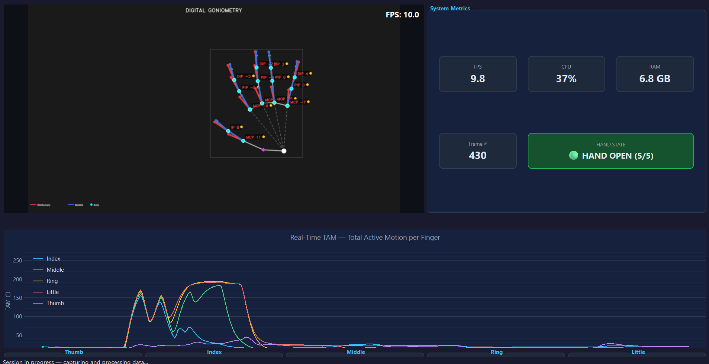

# Computer Vision-Based Hand Kinematic Assessment

<div align="center">
  
</div>

> **Real-time goniometric measurement system for functional assessment of hand fingers, using computer vision and desktop interface.**

[](https://www.python.org/)
[](https://www.riverbankcomputing.com/software/pyqt/)
[](https://mediapipe.dev/)
[](https://opencv.org/)
[](LICENSE)

---

## Table of Contents

- [About the Project](#about-the-project)
- [Features](#features)
- [System Architecture](#system-architecture)
- [Technologies Used](#technologies-used)
- [Prerequisites](#prerequisites)
- [Installation](#installation)
- [How to Run](#how-to-run)
- [Project Structure](#project-structure)
- [Configuration](#configuration)
- [Report Generation](#report-generation)
- [System Logs](#system-logs)
- [Contributing](#contributing)

---

## About the Project

**Computer Vision-Based Hand Kinematic Assessment** is a clinical desktop application developed for healthcare professionals — physiotherapists, occupational therapists, and doctors — who need to accurately measure the flexion/extension angles of the hand finger joints in real time.

The system uses the computer's camera, without the need for any additional physical equipment (such as the traditional manual goniometer), and automatically detects the anatomical landmarks of the hand to calculate the joint angles of the **MCP**, **PIP**, **DIP** joints, and, for the thumb, **IP** and **ABD**.

### Clinical Context

Goniometry is the gold-standard method for assessing joint range of motion (ROM). In a rehabilitation context, frequent and objective measurements are essential to track patient progress. This system digitizes and accelerates this process, eliminating the operator-dependent error of the physical goniometer.

---

## Features

- **Real-time video capture** via webcam with HD resolution (1280x720)
- **Automatic landmark detection** of the 21 hand joints via MediaPipe
- **Real-time goniometric calculation** for the 5 fingers (Index, Middle, Ring, Pinky, and Thumb)
- **Dynamic charts** with angle history per joint (PyQtGraph)
- **Clinical metrics dashboard** with minimum, maximum, and average amplitude of the session
- **Dual smoothing pipeline** — Exponential Moving Average (EMA) + Kalman Filter — to eliminate jitter without introducing latency
- **Session recording to CSV** with timestamp and values per joint
- **PDF report generation** with clinical summary of the session
- **Dark Mode interface** professional and responsive
- **Real-time log panel** embedded in the interface
- **Centralized configuration** — all parameters in a single `config.py` file

---

## System Architecture

The system is built on a **Producer-Consumer pattern with Qt Workers**, ensuring that video capture, AI processing, and UI updates are completely decoupled and do not block the graphical interface.

```
+------------------------------------------------------------------+
|                        app_pyqt.py                               |
|                  (Entry Point + Logging)                         |
+-------------------------+----------------------------------------+
                          |
                          v
+------------------------------------------------------------------+
|                    ui/main_window.py                             |
|              (Main UI Orchestrator)                              |
|                                                                  |
|  +--------------+  +--------------+  +---------------------+     |
|  | video_widget |  | plot_widget  |  | finger_card_widget  |     |
|  |  (Preview)   |  |  (Charts)    |  |  (Cards per Finger) |     |
|  +--------------+  +--------------+  +---------------------+     |
|  +--------------+  +--------------+  +---------------------+     |
|  |session_header|  |metrics_widget|  |    log_widget       |     |
|  |   (Header)   |  |  (Metrics)   |  | (Real-time log)     |     |
|  +--------------+  +--------------+  +---------------------+     |
+---------------------------+--------------------------------------+
                            | Qt Signals (thread-safe)
             +--------------+--------------+
             v                             v
+--------------------+         +----------------------+
|   workers/         |  Queue  |   workers/           |
|   CameraWorker     +-------->|   ProcessingWorker   |
|  (Camera Thread)   |  (=1)   | (AI/Calculation Thr.)|
+--------------------+         +----------+-----------+
                                          |
                              +-----+-----+------+
                              v     v            v
                         goniometry  smoothing  clinical_
                            .py        .py      classification.py
```

**Design principles:**
- **Thread Safety**: All communication between threads uses Qt signals/slots — never direct UI access from secondary threads.
- **Queue Size = 1**: The queue between CameraWorker and ProcessingWorker has a maximum size of 1, ensuring that the processor always receives the most recent frame (without latency accumulation).
- **Centralized configuration**: No "magic numbers" scattered throughout the code — everything in `config.py`.

---

## Technologies Used

| Category | Technology | Version |
|-----------|-----------|--------|
| **Language** | Python | 3.11+ |
| **Graphical Interface** | PyQt6 | 6.6+ |
| **Real-Time Charts** | PyQtGraph | 0.13+ |
| **Computer Vision** | MediaPipe | 0.10.11-0.10.17 |
| **Video Capture** | OpenCV (cv2) | 4.9+ |
| **Mathematical Calculations**| NumPy | 1.24-1.x |
| **PDF Reports** | FPDF2 | 2.7+ |
| **Data Visualization** | Matplotlib | 3.7+ |
| **Monitoring** | Logging (stdlib) | native |
| **Resource Monitoring** | psutil | 5.9+ |

### Technical Summary

* **Language**: Python 3.11+
* **Interface**: PyQt6
* **Computer Vision**: MediaPipe & OpenCV
* **Mathematical Calculations**: NumPy
* **Reports**: FPDF2
* **System Logs**: Native `logging` module

---

## Prerequisites

- **Operating System**: Windows 10/11 (recommended), Linux or macOS
- **Python**: 3.10 or 3.11 (mandatory — MediaPipe limitation)
- **Camera**: Integrated or USB webcam with minimum 720p resolution
- **RAM**: Minimum 4 GB (8 GB recommended)
- **GPU**: Not required — processing is performed on CPU

---

## Installation

### 1. Clone the repository

```bash
git clone https://github.com/your-username/computer-vision-based-hand-kinematic-assessment.git
cd computer-vision-based-hand-kinematic-assessment
```

### 2. Create and activate a virtual environment

```bash
# Windows
python -m venv .venv
.venv\Scripts\activate

# Linux/macOS
python3 -m venv .venv
source .venv/bin/activate
```

### 3. Install the dependencies

```bash
pip install -r requirements.txt
```

> **Attention (Windows):** If an SSL error occurs when installing `aiortc`, run:
> ```bash
> pip install aiortc==1.9.0
> ```

---

## How to Run

### Desktop Interface (PyQt6) — Recommended

```bash
python app_pyqt.py
```

---

## Project Structure

```
computer-vision-based-hand-kinematic-assessment/
|
+-- app_pyqt.py                  # Main entry point (PyQt6)
+-- config.py                    # Centralized configuration (global params)
+-- goniometry.py                # Goniometric calculation engine (joint angles)
+-- goniometry_overlay.py        # Overlay rendering on the camera image
+-- goniometry_csv.py            # Session data recording in CSV
+-- session_report.py            # Clinical report generation in PDF
+-- smoothing.py                 # Smoothing pipeline (EMA + Kalman Filter)
+-- clinical_classification.py   # Clinical classification of measured angles
+-- dashboard_utils.py           # Dashboard utilities
+-- themes.py                    # Dark Mode visual theme (Qt styles)
+-- requirements.txt             # Project dependencies
|
+-- ui/                          # Graphical interface (PyQt6 widgets)
|   +-- main_window.py           #   Main window (orchestrator)
|   +-- video_widget.py          #   Camera preview widget
|   +-- plot_widget.py           #   Real-time charts widget
|   +-- finger_card_widget.py    #   Individual cards per finger
|   +-- metrics_widget.py        #   Clinical metrics dashboard
|   +-- session_header.py        #   Session header
|   +-- log_widget.py            #   Embedded logs panel
|
+-- workers/                     # Processing threads (Producer-Consumer)
|   +-- camera_worker.py         #   Video capture thread
|   +-- processing_worker.py     #   AI processing + calculations thread
|
+-- assets/                      # Static resources (icons, images)
+-- logs/                        # Application generated logs
+-- tests/                       # Automated tests
```

---

## Configuration

All system parameters are centralized in [`config.py`](config.py). It is not necessary to change any other file to adjust the system behavior.

### Main parameters

| Parameter | Default Value | Description |
|-----------|-------------|-----------|
| `CAMERA_INDEX` | `0` | Camera index (0 = default) |
| `CAMERA_WIDTH` | `1280` | Capture width in pixels |
| `CAMERA_HEIGHT` | `720` | Capture height in pixels |
| `TARGET_FPS` | `30` | Target frame rate |
| `EMA_ALPHA` | `0.30` | EMA smoothing factor (0-1) |
| `KALMAN_Q` | `0.01` | Process noise (Kalman Filter) |
| `KALMAN_R` | `0.10` | Measurement noise (Kalman Filter) |
| `MP_DETECT_CONF` | `0.70` | Minimum detection confidence (MediaPipe) |
| `MP_TRACK_CONF` | `0.50` | Minimum tracking confidence (MediaPipe) |
| `BUFFER_SIZE` | `500` | History points in charts (~16s at 30 FPS) |
| `CSV_LOG_INTERVAL` | `3` | CSV recording frequency (every N frames) |

### Change camera

If the computer has multiple cameras, change in `config.py`:

```python
CAMERA_INDEX: int = 1  # 0 = default, 1 = external camera, etc.
```

---

## Report Generation

Upon ending an evaluation session, the system automatically generates:

1. **CSV File** — contains the raw values of all joint angles with timestamp, recorded at approximately 10 samples/second.
2. **PDF Report** — clinical summary of the session with minimum, maximum, and average amplitude per joint, generated via [`session_report.py`](session_report.py) with the FPDF2 library.

The files are saved in the project root folder with the session timestamp in the file name.

---

## System Logs

The system maintains two log levels:

| Type | Location | Content |
|------|------------|----------|
| **Application Log** | `logs/app.log` | System events, errors, initialization |
| **Session Log (CSV)** | Project root | Clinical data (angles per frame) |

The application log uses the native Python `logging` module, configured in [`app_pyqt.py`](app_pyqt.py) to log simultaneously to the **console** (terminal) and the **file** `logs/app.log`.

Standard message format:

```
2026-06-23 14:35:12,123 | INFO     | ui.main_window | Session started
2026-06-23 14:35:45,891 | WARNING  | workers.camera | Frame dropped (queue full)
2026-06-23 14:36:02,045 | ERROR    | goniometry     | Insufficient landmarks
```

---

## Contributing

Contributions are welcome. To contribute:

1. Fork the project
2. Create a branch for your feature: `git checkout -b feature/my-feature`
3. Commit your changes: `git commit -m "feat: add my feature"`
4. Push to the branch: `git push origin feature/my-feature`
5. Open a Pull Request

### Code standards

- Follow existing naming conventions (`snake_case` for functions/variables, `UPPER_CASE` for constants)
- Any new numeric parameter must be added to `config.py`, never inline in the code
- Docstrings are mandatory for new functions and classes
- Keep tests in `/tests` up to date

---

## License

This project is licensed under the MIT License. See the [LICENSE](LICENSE) file for more details.

---

Developed for clinical application in physiotherapy and occupational therapy.
